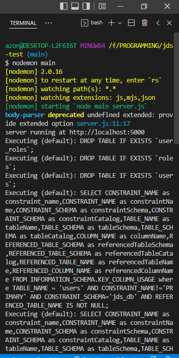

# jds-test
> web aplikasi register dan login dengan node js


## How to use

Windows:

```sh
git clone https://github.com/drnhsproject/jds-test.git
```

## Preparation

Karena ini menggunakan database MySql jadi bisa buat dulu database nya kemudian bisa import file sql yang ada di folder _database/file sql_, setelah itu di server local kita jalankan servernya kalau saya menggunakan xampp jadi jalankan apache dan mysql. setelah ready semuanya sekarang kita mulai membuka projectnya.

## Run the project

Pertama pastikan di laptop/pc sudah terinstall git bash supaya memudahan dalam menggunakan perintah cli dan juga disini saya menggunakan visual studio code, setelah itu masuk kedalam folder yang telah kita tadi clone dari github, kemudian klik kanan di folder tersebut lalu pilih git bash here dan akan muncul git bash yang sudah berada pada folder project kita, langkah selanjutnya :

Pada git bash kita ketikan :
```sh
code .
```
makan akan terbuka visual studio code dengan struktur project kita di dalamnya, selanjutnya kita open terminal di visual studio code atau bisa juga menggunakan git bash yang tadi di open akan tetapi agar kita tidak bolak-balik aplikasi maka kita gunakan saja aplikasi terminal bawaan vscode lalu pilih terminal seperti dibawah ini:


setelah itu ketikan pada terminal kita di vscode
```sh
nodemon main
```

maka akan tampil seperti dibawah ini, dan secara otomatis akan mirgartion tabel yang sudah kita buat sebelumnya :



setelah running kita bisa melakukan api testing disini saya menggunakan postman, jadi yang belum install boleh install dulu atau bisa juga menggunakan api testing yang lain, yang pertama kita setting postmannya seperti dibawah ini, mulai dari method nya post, url, body dll, untuk password biarkan kosong karena itu akan tergeneratr otomatis setelah semua sesuai klik send dan akan mendapatkan response seperti pada kolom sebelah kanan:


setelah username berhasil melaukan resistrasi maka kita ketahap selanjutnya yaitu melakukan sigin, yang pertama kita setting postmannya seperti dibawah ini, mulai dari method nya post, url, body dll, untuk username dan password bisa di copy saja dari api signup setelah semua sesuai klik send dan akan mendapatkan response seperti pada kolom sebelah kanan:


dan jika kita lihat di databasenya maka data user sudah terinput :


sekian penjelasan singkat untuk penggunakan web register dan login menggunakan node js.

## Meta

Dian Rahmat – [@hadireborn99](https://www.instagram.com/hadireborn99) – dian.rahmat74@gmail.com

[https://github.com/drnhsproject/jds-test](https://github.com/drnhsproject/jds-test)


